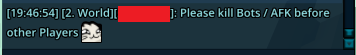
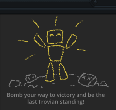
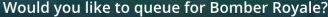
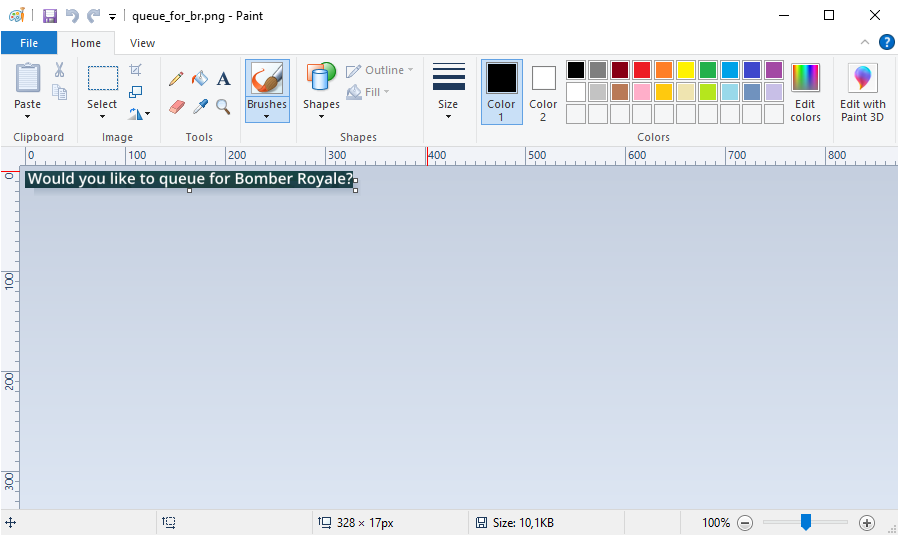
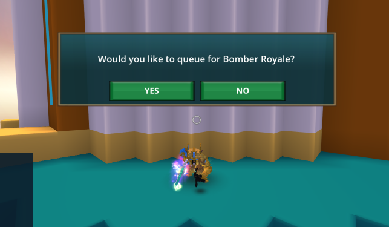
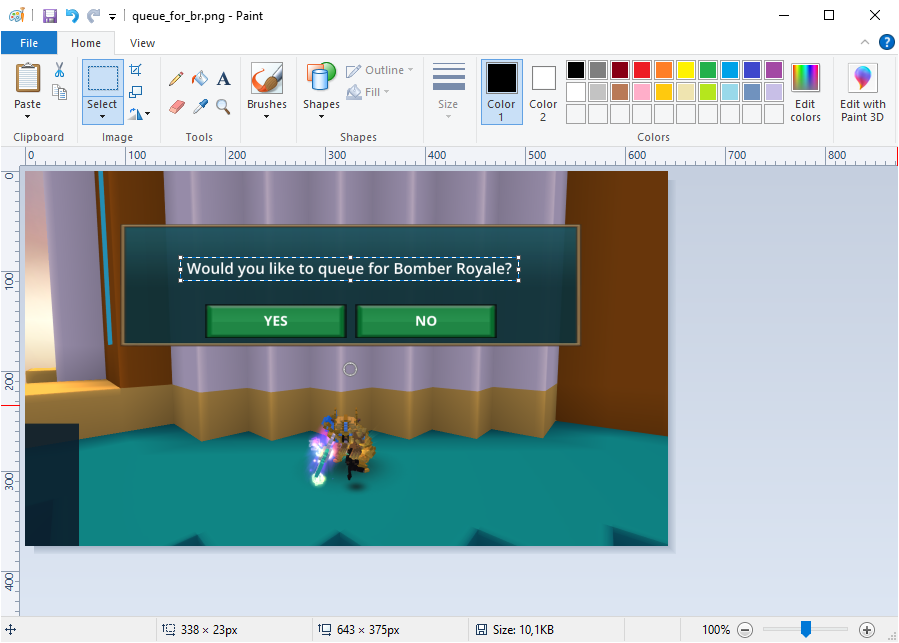
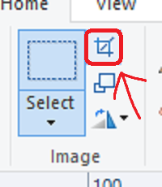

# Trove Bomber Royale Requeue (Not Updated)

_As of June 28, 2022. Changes were made to Bomber Royale, meaning you can no longer type `/respawn` to end the game quickly_

Getting tired of playing Bomber Royale in Trove?

Want to get the coins, but not put in the work?

Well! Here is the ~~bad~~ solution!

## Table of Contents

- [What is it?](#what-is-it-)
- [How does it work?](#how-does-it-work-)
- [Setting things up](#setting-things-up)
  - [Screenshots](#screenshots)
  - [Changing the Screenshots](#changing-the-screenshots)
- [Starting it](#starting-it)
- [It's not working for me, what do I do?](#it-s-not-working-for-me--what-do-i-do-)
  - [Bot is not clicking at all](#bot-is-not-clicking-at-all)
  - [Clicking the Wrong Place](#clicking-the-wrong-place)

## What is it?

In the main folder, you'll find 3 `.bat` scripts, the `Python Dependencies` script, and 2 different `Bomber Royale Requeue` scripts.

The `Python Dependencies` will let you easily download the needed Dependencies for Python.

The `Bomber Royale Requeue` scripts both do the same, and function to let you run the Python Bot.

## How does it work?

When the **Trove BR Requeue** script is run, it will first attempt to Queue for a Bomber Royale Game after which it will periodically search your entire screen (all monitors) for certain things. To do this, it has been provided some Screenshots which it will use to match up against.

When a match has been found, it will then decide what action to perform, which could be clicking _Reconnect_ or typing something in chat.

When the Bot enters a new Bomber Royale Game, it will firstly Jump to get rid of the wings, making your character slightly more hidden. It will then type in chat, telling people to kill Bots and AFK people first

|  |
| ------------------------------------------------------------------------------ |

_Image taken with [TheSymbols Chat Mod](https://trovesaurus.com/mod=2649/thesymbols-chat-mod)_

As the game progresses, players will be trying to kill eachother and you, but sometimes you may end up in a game with no active players. After being in a game for 2 minutes, the Bot will respawn, and then requeue for another game.

Due to the amount of Bots found when playing Bomber Royale, it is often faster to settle for 8th place, and get a single coin then requeue, than waiting longer and trying to get 3 or 5 coins.

## Setting things up

To set things up, you'll need to have [Python](https://www.python.org/) installed. On Windows, this is easily done with the [Microsoft Store](https://apps.microsoft.com/store/search/Python).

Once Python has been installed, I suggest running the `Python Dependencies` file, which will take care of installing the needed Python Dependencies

After that, the bot should be able to run, though it may not work yet due to the bot using **Screenshots** to determine how to act

### Screenshots

Because the Python Bot uses Screenshots, you may need to change the screenshots yourself. Currently the Bot requires these following images to work. And you'll find them in the `requeue_bot/images` folder:

|                            Image                             |       File Name       |                                          Required to work                                           |
| :----------------------------------------------------------: | :-------------------: | :-------------------------------------------------------------------------------------------------: |
|       |   `br_requeue.png`    |                                                 Yes                                                 |
|      |   `br_new_game.png`   | No   (Without this the bot won't say "please kill bots and afk first" to other players) |
|     |  `queue_for_br.png`   |                                    No (Just queue yourself)                                     |
|          |     `btn_yes.png`     |                                      No (Just queue yourself)                                       |
|  | `trove_reconnect.png` |                              No (Can't reconnect to Trove Servers)                              |
|    |  `trove_crashed.png`  |                        No (Can't restart game) [NOT IMPLEMENTED YET]                        |

### Changing the Screenshots

I'll guide you through the process of changing a screenshot. This example will be using the `queue_for_br` image.

To replace any of the screenshots, the easiest way is to first find the file itself, Right Click it, and click Edit. This will open the image in Paint.

|  |
| ------------------------------------------------ |

Then, head into Trove, and reproduce the screen where the screenshot was taken, for this it was simply attempting to queue for Bomber Royale.

To get a Screenshot of this, on your Keyboard press `Alt` and `PrtSc`, _also known as Print Screen_.

|  |
| ----------------------------------------------------------- |

Then go back to paint. Here you just Paste the image and then select the part you need with the Select Tool.

|  |
| ------------------------------------------------------------------- |

And lastly press the Crop Tool.

|  |
| ------------------------------------------- |

After this has been done, simply Save the file (`Ctrl + S`) and repeat for the other images.

## Starting it

To start the script, simply run either of the `Bomber Royale Requeue` batch scripts. The Bot is being developped using Python 3.10 and uses a couple of Pip installed Libraries.

Assuming Python has been installed, and the Libraries have been too, the Script should work when started.

## It's not working for me, what do I do?

If the bot is not working, it can help to run it as Debug Mode. The bot will then inform you about what it is trying to do.

### Bot is not clicking at all

If the bot isn't clicking at all, and says it's attempting to find the images, it is likely unable to find them on the screen. This can be due to the Resolution being different, or some UI mods changing the buttons

To fix this, please follow the [guide](#changing-the-screenshots)

### Clicking the Wrong Place

This issue can occur when either the Screenshots aren't precise enough, or the Screen Offset hasn't been correctly set.

If the Cursor is clicking very differently from where it is supposed to, it is likely due to the Offset being off, to fix this, Run the bot again, and say "Yes" to setting the Offset

If the Cursor is clicking closely to the buttons, but just barely to the Top Left of them, it is likely the Screenshots used being a little off.

It is important, that the Screenshots Top-Left Corner is part of the button. To fix this, open up the screenshots and Crop it a little more, so the Top Left corner is part of the button
